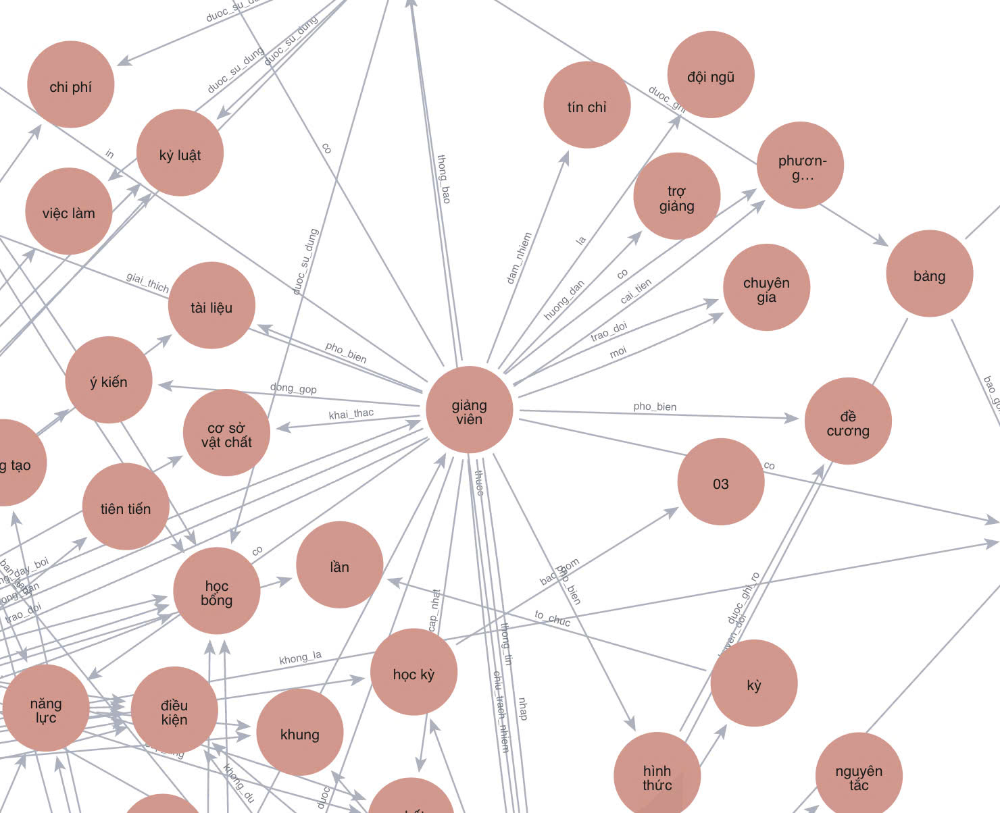

# Explainable Academic Advising via Category-Routed Knowledge Graph Retrieval and Generation

## Authors and Affiliations

**Huu-Hoa Nguyen, Tri-Tam La, and Thanh Ma**

College of Information and Communication Technology, Can Tho University, 3/2 Street, Can Tho City, 900000, Vietnam  

## Published Article

This work has been published in **Applied Intelligence**.

**DOI:** [10.1007/s10489-026-07300-3](https://doi.org/10.1007/s10489-026-07300-3)

## Abstract

Advising on academic regulations is difficult because sources are fragmented, frequently revised, and written in administrative prose. We present **CRANE**, a five-stage category-routed advising framework with two algorithms: **CRANE Build** for offline construction and **CRANE Resolve** for online answering. It unifies dense retrieval with graph-guided reasoning over a regulation-enriched graph. A lightweight classifier routes each query to a domain-specific subgraph and restricts vector search to the matching index partition. Graph evidence is gated by an edge-confidence threshold τ and does not affect vector similarity. Vietnamese named-entity recognition and **PhoBERT** embeddings provide language-appropriate enrichment, and the generator receives a structured prompt with citations and version metadata.

We evaluate CRANE on institutional question–answering (Q-A) using two resources: 13,684 labeled queries and 8,635 Q-A pairs verified by academic staff. Under protocol parity, CRANE attains an F1 Score of 99.03% with GPT and 98.69% with Mistral at τ = 0.6. It improves over a vector-only RAG baseline by 3.66 and 3.71 points while maintaining average end-to-end latency near 7 s per query. The domain router reaches 97.29% accuracy and 96.72% F1 Score on six-way domain classification. Ablation studies show that removing query routing, named-entity recognition, or budgeted τ-thresholded graph expansion reduces F1 Score by 2.56–4.38 points. Sensitivity peaks at τ = 0.6. Scalability tests keep accuracy stable with near-linear latency as the vector index grows. Overall, these results indicate that category-routed retrieval with confidence-gated graph evidence can deliver verifiable regulation advising with high accuracy under a bounded latency budget.

## Illustrative Fragment of the Regulation-Enriched Graph

The following figure shows an illustrative fragment of the regulation-enriched graph (REG) used in CRANE. It visually summarizes part of the entity–relation structure that supports graph-guided evidence expansion. The figure is included for illustration and overview purposes, rather than as a complete visualization of the full graph.

  

  <em>Illustrative fragment of the regulation-enriched graph used for evidence expansion in CRANE.</em>

